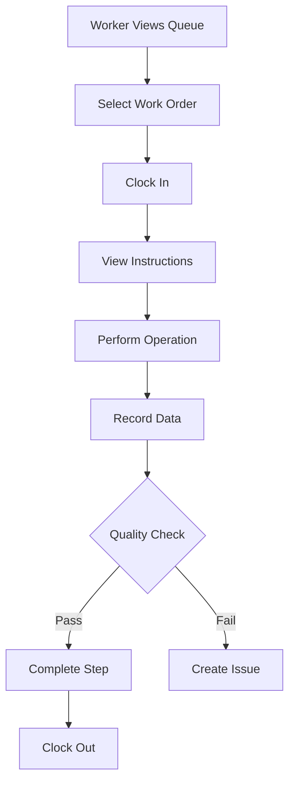

# Alamo MES/MRP System Architecture

## Executive Summary

Alamo is a modern Manufacturing Execution System (MES) integrated with Material Requirements Planning (MRP) capabilities, currently undergoing a major transformation from a part-centric work instruction system to a full-featured, operation-based manufacturing platform. This document provides a comprehensive overview of the data model, business logic, and key user workflows.

## Table of Contents

1. [System Overview](#system-overview)
2. [Data Model Architecture](#data-model-architecture)
3. [Business Logic & Core Concepts](#business-logic--core-concepts)
4. [Key User Workflows](#key-user-workflows)
5. [MES Evolution Strategy](#mes-evolution-strategy)
6. [Technical Implementation](#technical-implementation)

## System Overview

### Current State
Alamo started as a part-centric work instruction system with basic production tracking capabilities. The system currently manages:
- Parts library with BOM structures
- Work orders with work instructions
- Basic inventory tracking
- User management with RBAC
- File management for CAD and documentation

### Target State (Post-MES Evolution)
The system is evolving into an industry-standard MES/MRP platform featuring:
- **Reusable Operations & Procedures**: Standardized manufacturing processes
- **Flexible Routing Systems**: Multiple manufacturing paths per part
- **Advanced Production Tracking**: Operation-level scheduling and tracking
- **Batch/Nested Production**: Support for complex manufacturing scenarios
- **Real-time Work Readiness**: Dependency tracking and status visibility
- **Comprehensive Time & Cost Tracking**: Labor and resource utilization

## Data Model Architecture

### Core Entity Relationships

```
┌─────────────────────────────────────────────────────────┐
│                    MES/MRP Data Flow                     │
├─────────────────────────────────────────────────────────┤
│                                                           │
│  Parts ──┬──> Routings ──> Routing Steps                │
│          │        │              │                       │
│          │        │              ├──> Operations        │
│          │        │              └──> Work Centers      │
│          │        │                                      │
│          └──> Work Orders ──> Work Instructions         │
│                   │                │                     │
│                   │                └──> Steps & Actions  │
│                   │                                      │
│                   └──> Time Tracking & Labor            │
│                                                          │
└─────────────────────────────────────────────────────────┘
```

### Primary Entities

#### 1. **Parts Management**
```typescript
Part {
  id: UUID
  partNumber: String (unique)
  name: String
  description: String
  partType: Enum (ASSEMBLY, MODULE, SUBASSEMBLY, PART, RAW)
  trackingType: Enum (SERIAL, BATCH, LOT)
  // Relationships
  bomParts: BOMPart[]
  workInstructions: WorkInstruction[]
  routings: Routing[]
  inventory: Inventory[]
}
```

**Purpose**: Central repository for all manufactured and purchased parts, supporting multi-level BOM structures and version control.

#### 2. **Work Centers**
```typescript
WorkCenter {
  id: UUID
  code: String (unique)
  name: String
  type: Enum (MACHINING, ASSEMBLY, INSPECTION, etc.)
  capacity: Float (units/hour)
  efficiency: Float (0-1)
  setupTime: Integer (minutes)
  costPerHour: Float
  // Relationships
  operations: Operation[]
  routingSteps: RoutingStep[]
}
```

**Purpose**: Physical or logical locations where manufacturing operations are performed, enabling capacity planning and scheduling.

#### 3. **Operations**
```typescript
Operation {
  id: UUID
  code: String (unique)
  name: String
  workCenterId: String
  defaultDuration: Integer (minutes)
  setupTime: Integer
  requiresSkill: String (optional)
  // Relationships
  procedures: Procedure[]
  routingSteps: RoutingStep[]
}
```

**Purpose**: Reusable, atomic units of work that can be scheduled and tracked, decoupled from specific parts for maximum flexibility.

#### 4. **Routings**
```typescript
Routing {
  id: UUID
  partId: String
  routingNumber: String
  version: Integer
  isActive: Boolean
  effectiveDate: DateTime
  // Relationships
  steps: RoutingStep[]
}
```

**Purpose**: Defines the manufacturing process flow for a part, supporting multiple routing options (standard, rush, alternate).

#### 5. **Work Orders**
```typescript
WorkOrder {
  id: UUID
  workOrderNumber: String
  partId: String
  partQty: Integer
  status: Enum (DRAFT, TODO, IN_PROGRESS, COMPLETED, etc.)
  dueDate: DateTime
  // Relationships
  assignees: User[]
  workInstruction: WorkOrderWorkInstruction
  timeEntries: WorkOrderTimeEntry[]
  tags: WorkOrderTag[]
}
```

**Purpose**: Represents actual production jobs, tracking progress, time, and resource consumption.

#### 6. **Work Instructions**
```typescript
WorkInstruction {
  id: UUID
  partId: String
  title: String
  instructionNumber: String (unique)
  status: Enum (DRAFT, REVIEW, APPROVED)
  // Relationships
  steps: WorkInstructionStep[]
}

WorkInstructionStep {
  stepNumber: Integer
  title: String
  instructions: String
  estimatedLabourTime: Integer
  requiredTools: String[]
  actions: WorkInstructionStepAction[]
}
```

**Purpose**: Detailed, step-by-step guidance for operators, with embedded quality checks and data collection points.

### Supporting Entities

#### Inventory Management
- **Inventory**: Current stock levels by location
- **InventoryTransaction**: Movement and consumption history
- **Location**: Hierarchical warehouse structure

#### Time & Labor
- **ClockInEntry**: User clock-in/out for work orders
- **WorkOrderTimeEntry**: Detailed time tracking per operation

#### Quality & Compliance
- **WorkInstructionStepAction**: Quality checkpoints and measurements
- **Comment**: Traceability and communication system

## Business Logic & Core Concepts

### 1. **Operation-Based Manufacturing**

The system has evolved from tying instructions directly to parts to a more flexible model:

```
Old Model: Part → Work Instruction (1:1)
New Model: Part → Routing → Operations → Procedures (many:many)
```

**Benefits:**
- Reusable procedures across multiple parts
- Standardized time and cost calculations
- Flexible manufacturing paths
- Easier updates and version control

### 2. **Routing System**

Routings define how a part moves through the factory:

```typescript
// Example: Multiple routing options for a bracket
Bracket Part:
  ├── Standard Routing (10 operations)
  ├── Rush Routing (7 operations - skip non-critical)
  └── Prototype Routing (manual processes)
```

Each routing contains sequential steps that specify:
- Which operation to perform
- At which work center
- Setup and run times
- Queue and move times

### 3. **Work Order Lifecycle**

```
DRAFT → TODO → IN_PROGRESS → COMPLETED
         ↓           ↓
       HOLD      SCRAPPED
```

**Key States:**
- **DRAFT**: Planning stage, not released to production
- **TODO**: Released, waiting for execution
- **IN_PROGRESS**: Active production with time tracking
- **HOLD**: Temporarily suspended (quality issue, material shortage)
- **COMPLETED**: Finished and verified

### 4. **Time Tracking & Labor Management**

The system supports multiple time tracking methods:

1. **Clock-In System**: Workers clock into specific work orders
2. **Operation-Level Tracking**: Time per routing step
3. **Automatic Calculations**: Based on standard times and efficiency factors

```typescript
Actual Time = Standard Time × (1 / Efficiency) + Setup Time
Labor Cost = Actual Time × Work Center Cost Rate
```

### 5. **BOM & Material Management**

Multi-level BOM structure with two types:
- **Engineering BOM**: As-designed structure
- **Manufacturing BOM**: As-built structure with substitutions

```
Assembly
  ├── Subassembly A (Qty: 2)
  │     ├── Part X (Qty: 4)
  │     └── Part Y (Qty: 1)
  └── Raw Material B (Qty: 100g)
```

### 6. **Work Readiness Calculation**

Real-time calculation of work order readiness:

```typescript
Ready Conditions:
  ✓ Previous operations complete
  ✓ Materials available
  ✓ Work center available
  ✓ Tools/fixtures available
  ✓ Worker qualified
```

## Key User Workflows

### 1. **Production Planning Workflow**


**Steps:**
1. Planner receives demand (sales order or forecast)
2. Creates work order specifying part and quantity
3. System suggests optimal routing based on due date and capacity
4. Planner reviews and adjusts schedule
5. Work order released to shop floor

### 2. **Shop Floor Execution**



**Features:**
- Real-time work queue filtered by work center
- Digital work instructions with images/videos
- Inline quality checks and data collection
- Issue escalation and resolution tracking

### 3. **Quality Control Process**

```typescript
Quality Checkpoints:
  1. In-Process Inspection
     - Dimensional checks
     - Visual inspection
     - Test measurements
  
  2. Final Inspection
     - Complete product verification
     - Documentation review
     - Certificate generation
  
  3. Non-Conformance Management
     - Issue documentation
     - Root cause analysis
     - Corrective actions
```

### 4. **Inventory Management Flow**


**Transaction Types:**
- PURCHASE_RECEIPT: Incoming materials
- PRODUCTION_ISSUE: Materials to work orders
- PRODUCTION_RETURN: Unused materials
- MOVE: Location transfers
- ADJUSTMENT: Inventory corrections
- SHIPMENT: Finished goods dispatch

### 5. **Engineering Change Management**

```typescript
Change Process:
  1. Create new part/routing version
  2. Update affected BOMs
  3. Set effectivity dates
  4. Notify affected work orders
  5. Archive old versions
```

## MES Evolution Strategy

### Phase 1: Foundation (Weeks 1-2) ✅
**Status**: Completed

**Deliverables:**
- Work Centers schema and CRUD operations
- Operations schema and management
- Basic procedures framework
- Admin interfaces for master data

### Phase 2: Routing System (Weeks 3-4) 🚧
**Status**: In Progress

**Objectives:**
- Visual routing designer UI
- Routing templates and cloning
- Time/cost calculations
- Routing validation logic

### Phase 3: Work Order Evolution (Weeks 5-6) 📋
**Status**: Planned

**Goals:**
- Link work orders to routings
- Operation-level scheduling
- Enhanced execution interfaces
- Real-time progress tracking

### Phase 4: Batch Production (Weeks 7-8) 📋
**Status**: Planned

**Features:**
- Nest pattern management
- Shared operation handling
- Material optimization
- Batch work order creation

### Phase 5: Work Readiness (Weeks 9-10) 📋
**Status**: Planned

**Capabilities:**
- Dependency tracking engine
- Real-time status calculation
- Push notifications
- Bottleneck identification

### Phase 6: Migration & Training (Weeks 11-12) 📋
**Status**: Planned

**Activities:**
- Data migration scripts
- User training materials
- Parallel run period
- Go-live support

## Technical Implementation

### Technology Stack

**Frontend:**
- Next.js 14 (App Router)
- TypeScript
- Tailwind CSS
- shadcn/ui components
- TipTap editor for rich text

**Backend:**
- Next.js API routes
- Prisma ORM
- PostgreSQL database
- Server Actions for mutations

**Infrastructure:**
- Cloudflare R2 for file storage
- Autodesk Platform Services for CAD viewing
- Real-time updates via Server-Sent Events

### Key Design Patterns

#### 1. **Server Actions Pattern**
```typescript
// Example: Work Center CRUD
'use server';

export async function createWorkCenter(data: WorkCenterInput) {
  const session = await auth();
  if (!session?.user) throw new Error('Unauthorized');
  
  const validated = workCenterSchema.parse(data);
  const workCenter = await prisma.workCenter.create({ data: validated });
  
  revalidatePath('/production/work-centers');
  return workCenter;
}
```

#### 2. **Optimistic Updates**
```typescript
// Frontend immediately updates UI before server confirms
const optimisticUpdate = (data) => {
  setLocalState(data);
  serverAction(data).catch(() => revertLocalState());
};
```

#### 3. **Composite Pattern for BOM**
```typescript
interface BOMNode {
  part: Part;
  quantity: number;
  children: BOMNode[];
  
  getTotalCost(): number;
  getMaterialList(): Material[];
}
```

### Security & Permissions

**RBAC System:**
- Role-based access control
- Resource-specific permissions
- Hierarchical permission inheritance
- Audit logging for compliance

```typescript
Roles:
  ├── Admin (full system access)
  ├── Production Manager (work order management)
  ├── Operator (execute work orders)
  ├── Quality Inspector (approve/reject)
  └── Viewer (read-only access)
```

### Performance Considerations

1. **Database Optimization:**
   - Indexed foreign keys
   - Composite indexes for queries
   - Soft deletes for audit trail
   - Efficient pagination

2. **Caching Strategy:**
   - Static data cached at edge
   - User sessions in memory
   - Invalidation on updates

3. **Real-time Updates:**
   - SSE for live production status
   - Optimistic UI updates
   - Background job processing

## Migration Strategy

### Data Migration Approach

```typescript
Migration Steps:
  1. Create new tables alongside existing
  2. Build compatibility layer
  3. Migrate data in batches
  4. Run parallel for validation
  5. Cutover with rollback plan
  6. Archive deprecated tables
```

### Backwards Compatibility

During transition, maintain dual APIs:
```typescript
// Old API (deprecated)
GET /api/work-instructions/:partId

// New API
GET /api/routings/:partId
GET /api/operations/:operationId
```

## Success Metrics

### Target KPIs

| Metric | Current | Target | Impact |
|--------|---------|---------|---------|
| Work Order Creation Time | 15 min | 10 min | 33% reduction |
| Instruction Reusability | 10% | 60% | 6x improvement |
| On-Time Delivery | 75% | 94% | 25% increase |
| Setup Time | 45 min | 36 min | 20% reduction |
| First-Pass Yield | 85% | 95% | 12% improvement |

### User Adoption Goals

- 90% user adoption within 2 weeks
- < 5% increase in support tickets
- 80% user satisfaction score
- Zero critical bugs in production

## Conclusion

Alamo's evolution from a part-centric work instruction system to a comprehensive MES/MRP platform represents a significant advancement in manufacturing capabilities. By adopting industry-standard patterns while accommodating unique requirements, the system provides:

1. **Flexibility**: Multiple routings and reusable operations
2. **Visibility**: Real-time production status and readiness
3. **Efficiency**: Optimized resource utilization and scheduling
4. **Quality**: Embedded checks and traceability
5. **Scalability**: Architecture supporting growth

The phased implementation approach ensures minimal disruption while delivering incremental value, positioning Alamo as a modern, competitive manufacturing execution system.

## Appendix

### Glossary

- **MES**: Manufacturing Execution System - Shop floor control system
- **MRP**: Material Requirements Planning - Production planning system
- **BOM**: Bill of Materials - Component structure
- **Routing**: Manufacturing process sequence
- **Work Center**: Production resource/location
- **Operation**: Atomic unit of work
- **WIP**: Work In Progress - Partially completed products

### References

- [MES Design Learnings](./mes-design-learnings.md)
- [GitHub Issues #6-17](https://github.com/twd38/alamo-app/issues)
- Industry Standards: ISA-95, MESA Model