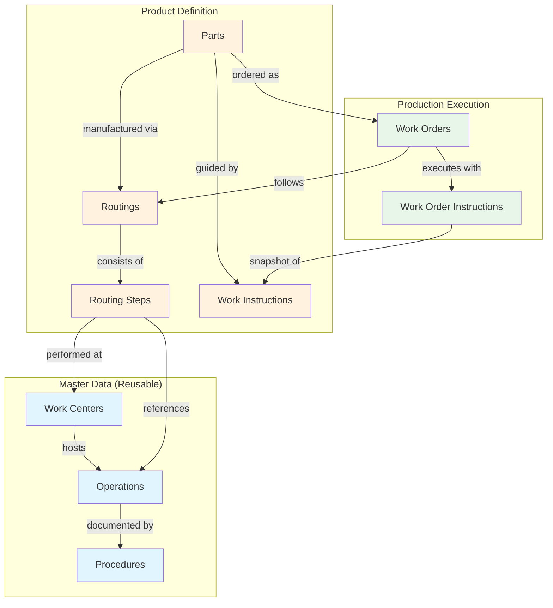
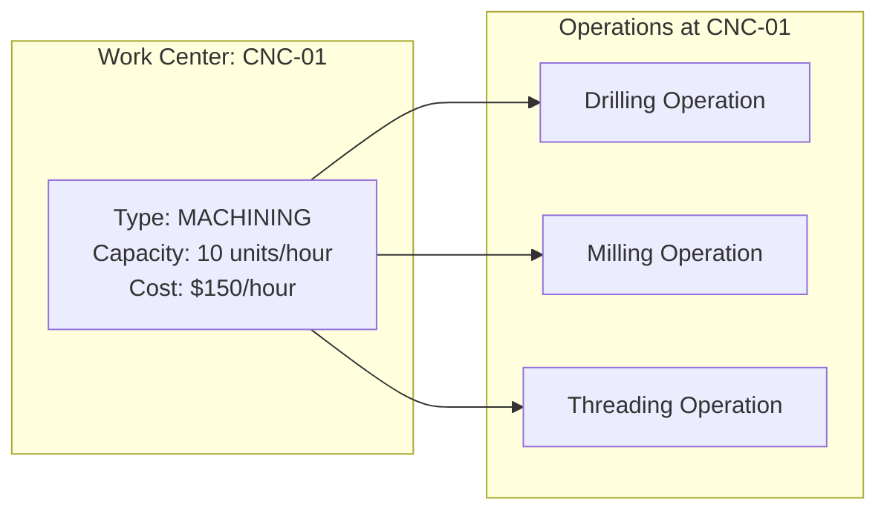
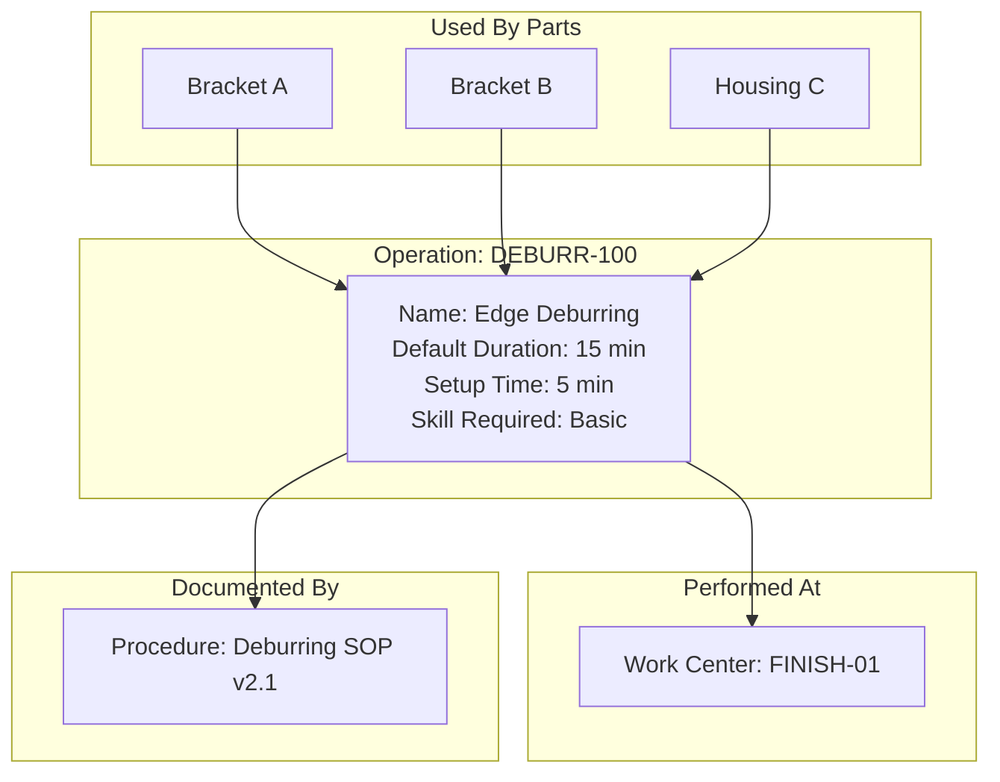
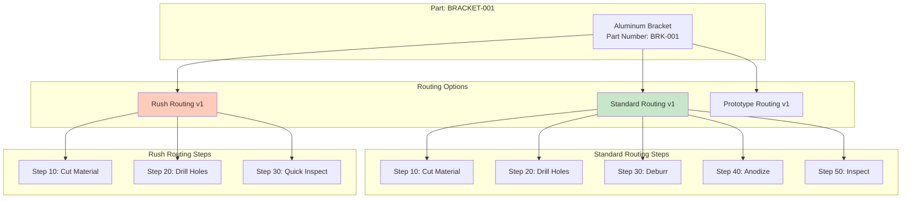
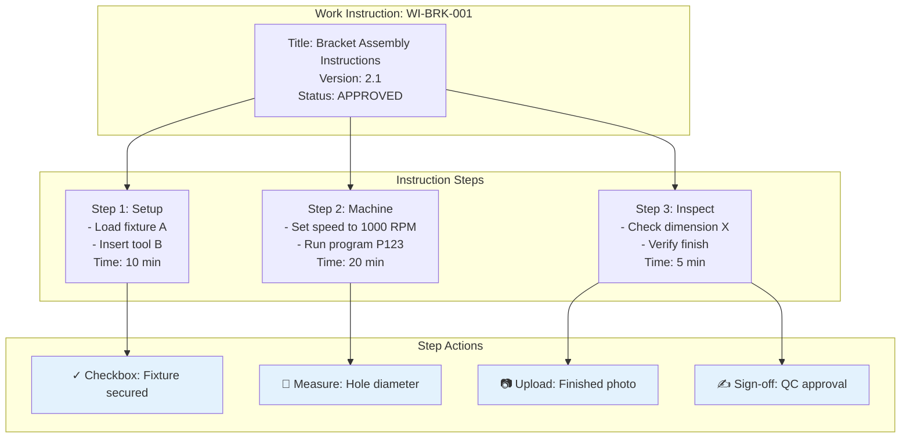
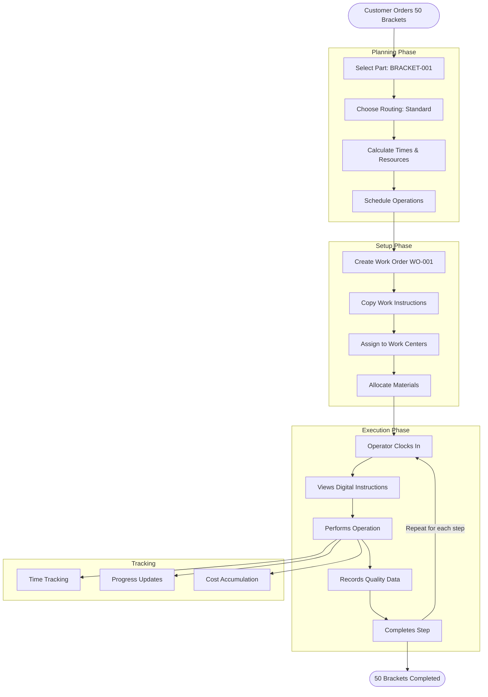
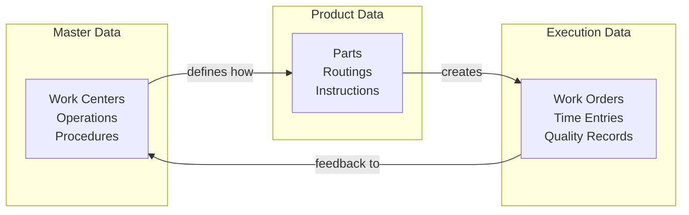
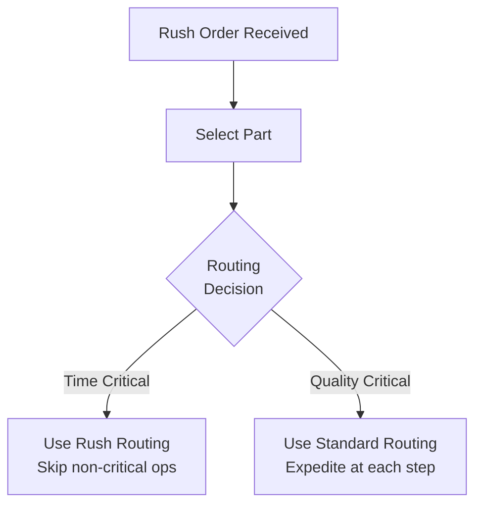
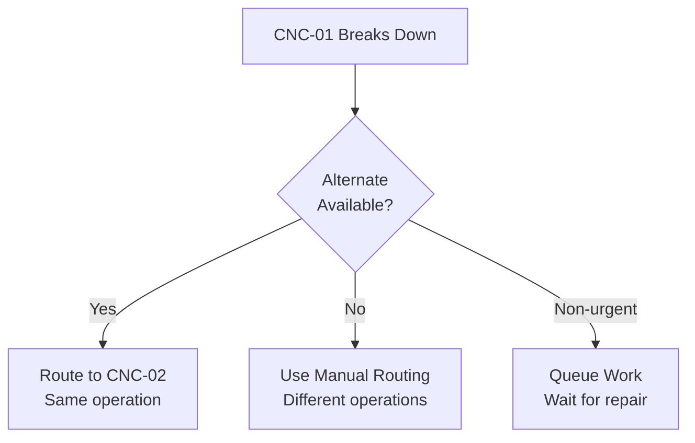
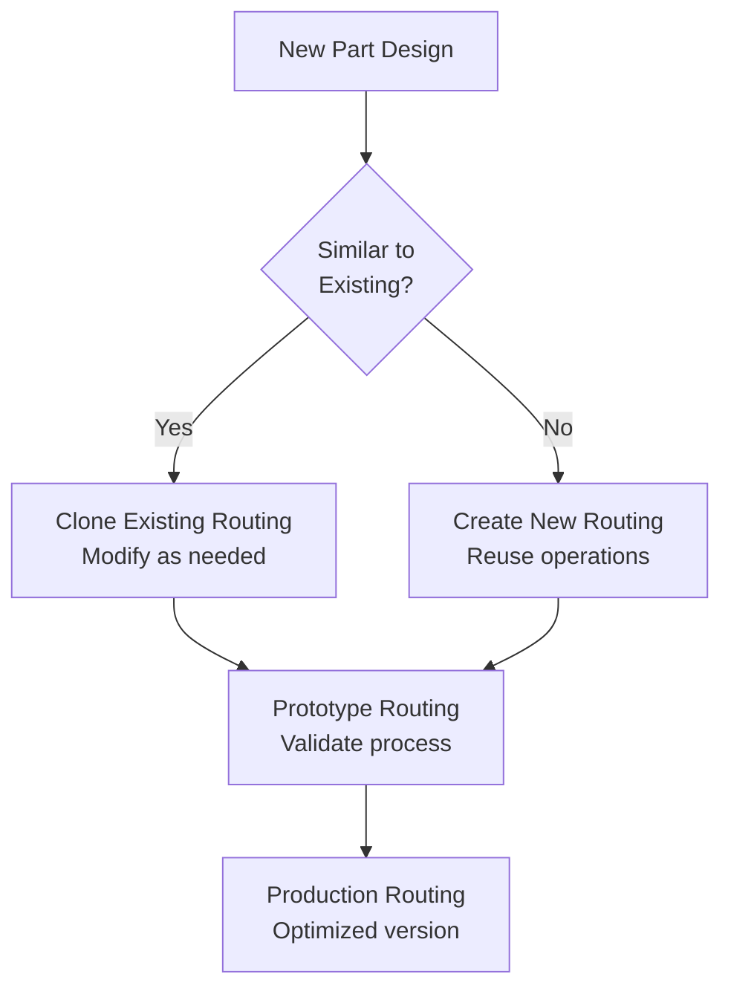

# MES Entity Relationships Deep Dive

## Overview
This document provides a detailed explanation of how the core MES entities relate to each other, with visual diagrams to illustrate the connections.

## The Big Picture



## Entity Relationships Explained

### 1. Work Centers - The Foundation
**What it is:** Physical or logical locations where work happens (e.g., CNC Machine #1, Assembly Station A, Inspection Bench)



**Key Relationships:**
- **Hosts Operations**: Each work center can perform multiple operations
- **Used by Routing Steps**: Routing steps specify which work center to use
- **Cost Center**: Tracks hourly costs for production accounting

### 2. Operations - Reusable Work Units
**What it is:** Standardized, atomic units of work that can be reused across different parts



**Key Concept:** Operations are REUSABLE - write once, use many times!

### 3. Parts → Routings → Routing Steps
**The Manufacturing Recipe**



**Why Multiple Routings?**
- **Standard**: Full process with all quality steps
- **Rush**: Expedited process, skip non-critical operations
- **Prototype**: Manual processes for one-off production
- **Alternate**: Use different equipment when primary is busy

### 4. Routing Steps Detail
**Connecting Operations to Work Centers**

```mermaid
graph LR
    subgraph "Routing Step 20"
        RS[Step Number: 20<br/>Setup: 15 min<br/>Run: 5 min/unit<br/>Queue: 30 min<br/>Move: 10 min]
    end
    
    subgraph "References"
        OP[Operation: DRILL-200<br/>Drill 4 Holes]
        WC[Work Center: CNC-01<br/>CNC Machine]
    end
    
    RS -->|what to do| OP
    RS -->|where to do it| WC
    
    subgraph "Time Calculation"
        CALC[Total Time = Setup + (Run × Qty) + Queue + Move<br/>Example: 15 + (5 × 10) + 30 + 10 = 105 min]
    end
    
    RS --> CALC
```

### 5. Work Instructions - Detailed Guidance
**Step-by-step instructions for operators**



### 6. Work Orders - Actual Production
**When a customer orders 100 brackets...**

```mermaid
graph TD
    subgraph "Work Order: WO-2024-001"
        WO[Part: BRACKET-001<br/>Quantity: 100<br/>Due Date: 2024-03-15<br/>Status: IN_PROGRESS]
    end
    
    subgraph "Selects"
        RT[Routing: Standard v1<br/>Selected based on due date]
    end
    
    subgraph "Creates Snapshot"
        WOWI[Work Order Instructions<br/>Frozen copy of current instructions]
    end
    
    subgraph "Execution Tracking"
        ET1[Step 1: ✅ Complete (10:30 AM)]
        ET2[Step 2: 🔄 In Progress (11:15 AM)]
        ET3[Step 3: ⏳ Pending]
        ET4[Step 4: ⏳ Pending]
    end
    
    WO --> RT
    WO --> WOWI
    WOWI --> ET1
    WOWI --> ET2
    WOWI --> ET3
    WOWI --> ET4
    
    style ET1 fill:#c8e6c9
    style ET2 fill:#fff9c4
    style ET3 fill:#f5f5f5
    style ET4 fill:#f5f5f5
```

## The Complete Flow: From Part to Production



## Real-World Example: Manufacturing a Bracket

### 1. Part Definition
```
Part: BRACKET-001 (Aluminum Mounting Bracket)
├── Engineering BOM
│   ├── Raw Aluminum Sheet (1 piece)
│   └── Hardware Kit (4 screws)
└── Available Routings
    ├── Standard Routing (5 operations)
    ├── Rush Routing (3 operations)
    └── Rework Routing (2 operations)
```

### 2. Standard Routing Breakdown
```
Routing: STANDARD-001
├── Step 10: Material Prep
│   ├── Operation: MAT-PREP-100
│   ├── Work Center: SAW-01
│   └── Time: 15 min setup + 2 min/piece
├── Step 20: CNC Machining
│   ├── Operation: CNC-DRILL-200
│   ├── Work Center: CNC-01
│   └── Time: 30 min setup + 5 min/piece
├── Step 30: Deburring
│   ├── Operation: DEBURR-100
│   ├── Work Center: FINISH-01
│   └── Time: 5 min setup + 3 min/piece
├── Step 40: Surface Treatment
│   ├── Operation: ANODIZE-300
│   ├── Work Center: CHEM-01
│   └── Time: 60 min batch process
└── Step 50: Final Inspection
    ├── Operation: INSPECT-500
    ├── Work Center: QC-01
    └── Time: 0 min setup + 2 min/piece
```

### 3. Work Order Execution
```
Work Order: WO-2024-0523
├── Part: BRACKET-001
├── Quantity: 50
├── Selected Routing: STANDARD-001
├── Total Estimated Time: 425 minutes
└── Current Status: Step 30 (60% complete)
    ├── Step 10: ✅ Completed (45 min actual)
    ├── Step 20: ✅ Completed (280 min actual)
    ├── Step 30: 🔄 In Progress (30/50 pieces)
    ├── Step 40: ⏳ Pending
    └── Step 50: ⏳ Pending
```

## Key Relationships Summary

### Reusability Hierarchy
```
Work Centers (Most Reusable)
    ↓
Operations (Highly Reusable)
    ↓
Routings (Part-Specific but Versioned)
    ↓
Work Instructions (Part-Specific)
    ↓
Work Orders (Instance-Specific)
```

### Data Flow


## Benefits of This Architecture

### 1. **Reusability**
- Operations are written once, used everywhere
- Standard times improve estimation accuracy
- Procedures ensure consistency

### 2. **Flexibility**
- Multiple routings per part for different scenarios
- Easy to add alternate work centers
- Version control for continuous improvement

### 3. **Traceability**
- Complete history of what was done
- Who performed each operation
- Quality data at each step

### 4. **Optimization**
- Identify bottlenecks at work centers
- Optimize routing sequences
- Balance workload across resources

### 5. **Scalability**
- Add new work centers without changing parts
- Create new routings without duplicating operations
- Expand operations library over time

## Common Scenarios

### Scenario 1: Rush Order


### Scenario 2: Machine Breakdown


### Scenario 3: New Part Introduction


## Conclusion

The relationship between these entities creates a flexible, scalable manufacturing system:

1. **Work Centers** provide the WHERE
2. **Operations** define the WHAT
3. **Routings** specify the SEQUENCE
4. **Routing Steps** combine WHO, WHAT, WHERE, and WHEN
5. **Work Instructions** detail the HOW
6. **Work Orders** track the ACTUAL execution

This architecture enables manufacturers to:
- Standardize processes across products
- Optimize resource utilization
- Maintain quality and traceability
- Adapt quickly to changes
- Scale operations efficiently

The key insight is that by separating reusable components (Operations, Work Centers) from product-specific elements (Parts, Routings), the system achieves both standardization and flexibility.