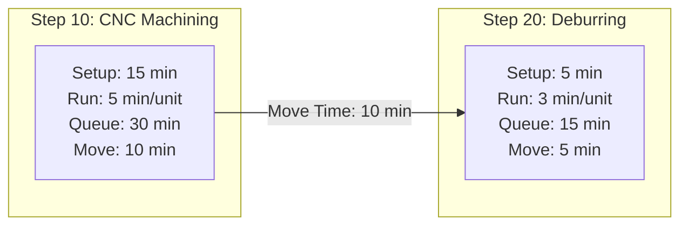
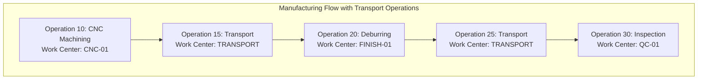

# Work Center Transportation & Material Movement Best Practices

## Current Implementation in Alamo

Alamo **DOES** handle transportation between work centers! Looking at the `RoutingStep` model:

```typescript
model RoutingStep {
  // ... other fields
  setupTime    Int  @default(0)  // Minutes
  runTime      Int               // Minutes per unit
  queueTime    Int  @default(0)  // Minutes - Wait time before operation
  moveTime     Int  @default(0)  // Minutes - Transportation time
}
```

The system tracks **four distinct time components** for each routing step:

1. **Setup Time**: Preparing the work center for the operation
2. **Run Time**: Actual operation time per unit
3. **Queue Time**: Waiting time before the operation can start
4. **Move Time**: Transportation time from previous work center

## How Transportation Should Be Specified

### Option 1: Move Time in Routing Step (Current Alamo Approach) ✅



**Pros:**
- Simple to implement
- Transportation is part of the total lead time
- Easy to calculate total time

**Cons:**
- Move time is "TO this operation" not "FROM this operation"
- Can be confusing which step owns the transportation

### Option 2: Separate Transportation Operations (Industry Best Practice)



**Pros:**
- Transportation is explicitly tracked
- Can assign resources (forklift operators)
- Better for complex logistics
- Can track transportation costs separately

**Cons:**
- More operations to manage
- More complex routing

## Best Practices for Different Scenarios

### 1. Simple, Linear Flow (Short Distances)
**Use: Move Time in Routing Steps**

```typescript
// Example: Small job shop with work centers in same building
RoutingStep {
  stepNumber: 10,
  operation: "DRILL-100",
  workCenter: "CNC-01",
  moveTime: 5,  // 5 minutes to walk part to next station
  queueTime: 10 // Wait in queue at next station
}
```

### 2. Complex Logistics (Long Distances, Special Handling)
**Use: Dedicated Transport Operations**

```typescript
// Example: Large facility, requires forklift
RoutingStep {
  stepNumber: 10,
  operation: "DRILL-100",
  workCenter: "CNC-01",
  moveTime: 0  // No move time here
}

RoutingStep {
  stepNumber: 15,
  operation: "TRANSPORT-100",
  workCenter: "FORKLIFT-01",
  runTime: 15,  // 15 minutes transport time
  notes: "Requires certified forklift operator"
}
```

### 3. Batch Transportation
**Use: Batch-Aware Transport Operations**

```typescript
// Example: Accumulate 10 units before moving
RoutingStep {
  stepNumber: 25,
  operation: "BATCH-TRANSPORT",
  workCenter: "AGV-01",  // Automated Guided Vehicle
  setupTime: 5,   // Load cart
  runTime: 2,     // Per unit loading
  moveTime: 20,   // Fixed transport time
  notes: "Min batch: 10 units, Max batch: 50 units"
}
```

## Recommended Approach for Alamo

Given Alamo's current architecture, here's the recommended approach:

### Phase 1: Enhance Current Model (Quick Win)
```typescript
// Use existing moveTime and queueTime fields effectively
RoutingStep {
  moveTime: 10,    // Transportation TO this work center
  queueTime: 15,   // Wait time at this work center
  
  // Add to notes for complex scenarios
  notes: "Requires temperature-controlled transport"
}
```

### Phase 2: Add Transportation Metadata (Future Enhancement)
```typescript
// Extend RoutingStep model
model RoutingStep {
  // ... existing fields
  moveTime         Int      @default(0)
  queueTime        Int      @default(0)
  
  // New transportation fields
  transportMethod  TransportMethod?  // MANUAL, FORKLIFT, AGV, CONVEYOR
  transportDistance Float?            // Meters
  specialHandling   String?           // "Temperature controlled", "ESD safe"
}

enum TransportMethod {
  MANUAL
  FORKLIFT
  PALLET_JACK
  AGV
  CONVEYOR
  CRANE
  CART
}
```

### Phase 3: Transportation Work Centers (Advanced)
Create specialized work centers for transportation:

```typescript
// Transportation Work Centers
WorkCenter {
  code: "TRANS-01",
  name: "Manual Transport",
  type: "OTHER",
  capacity: 10,  // Trips per hour
  costPerHour: 25
}

WorkCenter {
  code: "FORK-01",
  name: "Forklift Station 1",
  type: "OTHER",
  capacity: 6,   // Trips per hour
  costPerHour: 45
}
```

## Implementation Examples

### Example 1: Simple Product Flow
```typescript
// Bracket Manufacturing
Step 10: Cut Material
  - Work Center: SAW-01
  - Run Time: 5 min
  - Move Time: 3 min (walk to CNC)
  
Step 20: CNC Machine
  - Work Center: CNC-01
  - Run Time: 15 min
  - Move Time: 5 min (cart to deburr)
  
Step 30: Deburr
  - Work Center: FINISH-01
  - Run Time: 8 min
  - Move Time: 10 min (to inspection)

Total Transport Time: 18 minutes
```

### Example 2: Complex Product Flow
```typescript
// Engine Block Manufacturing
Step 10: Rough Machining
  - Work Center: CNC-ROUGH-01
  - Run Time: 45 min
  
Step 15: Transport to Building 2
  - Work Center: FORK-01
  - Operation: TRANSPORT-HEAVY
  - Run Time: 20 min
  - Notes: "Requires 2-ton capacity forklift"
  
Step 20: Heat Treatment
  - Work Center: FURNACE-01
  - Run Time: 240 min
  
Step 25: Controlled Cooldown Transport
  - Work Center: TRANS-SPECIAL
  - Operation: TRANSPORT-TEMP
  - Run Time: 30 min
  - Notes: "Maintain >100°C during transport"
```

## Key Decisions for Your Implementation

### 1. **For Simple Manufacturing:**
✅ Use the existing `moveTime` field in RoutingStep
- Sufficient for most job shops
- Easy to implement and understand
- No additional complexity

### 2. **For Complex Manufacturing:**
Consider adding:
- Transportation operations for long/complex moves
- Transport work centers for resource planning
- Special handling flags

### 3. **For Mixed Environments:**
- Use `moveTime` for simple moves (<10 min, same building)
- Create transport operations for complex moves
- Document in `notes` field when special handling required

## Calculating Total Lead Time

```typescript
function calculateTotalLeadTime(routingSteps: RoutingStep[], quantity: number) {
  let totalTime = 0;
  
  for (const step of routingSteps) {
    totalTime += step.setupTime;           // One-time setup
    totalTime += step.runTime * quantity;  // Per unit processing
    totalTime += step.queueTime;           // Waiting
    totalTime += step.moveTime;            // Transportation
  }
  
  return totalTime;
}

// Example: 10 brackets
// Step 1: 15 + (5*10) + 30 + 10 = 105 min
// Step 2: 5 + (3*10) + 15 + 5 = 55 min
// Total: 160 minutes (2.67 hours)
```

## Recommendations for Alamo

### Immediate Actions:
1. **Use existing `moveTime` field** - It's already there!
2. **Document transportation requirements** in the `notes` field
3. **Set standard move times** between common work center pairs

### Future Enhancements:
1. **Add transport method** to routing steps (manual, forklift, etc.)
2. **Create transport matrix** - Standard times between all work centers
3. **Consider transport work centers** for complex logistics

### Best Practice Guidelines:
1. **Always include move time** - Even if it's 0
2. **Queue time vs Move time**:
   - Queue: Waiting AT the work center
   - Move: Transportation TO the work center
3. **Document special requirements** in notes
4. **Consider batch transportation** for efficiency
5. **Track transportation costs** if significant

## Industry Standards Reference

### SAP PP (Production Planning):
- Uses "Interoperation Time" (includes move + queue)
- Can define transportation operations
- Supports transport work centers

### Oracle Manufacturing:
- "Move Time" at operation level
- "Queue Time" separate
- Optional transport resources

### Microsoft Dynamics 365:
- "Transit Time" between operations
- "Queue Time Before" and "Queue Time After"
- Transport as separate operations optional

## Conclusion

Alamo's current model with `moveTime` in RoutingStep is actually well-aligned with industry practices for most manufacturing scenarios. The key is to:

1. **Use it consistently** - Always specify move time, even if 0
2. **Be clear about ownership** - Move time is TO this operation
3. **Document special needs** - Use notes field for special handling
4. **Consider scale** - Add transport operations only when complexity demands it

For most implementations, the existing model is sufficient. Only add complexity (separate transport operations) when you have:
- Long distance moves (>30 minutes)
- Special equipment requirements
- Need to schedule transport resources
- Complex material handling requirements