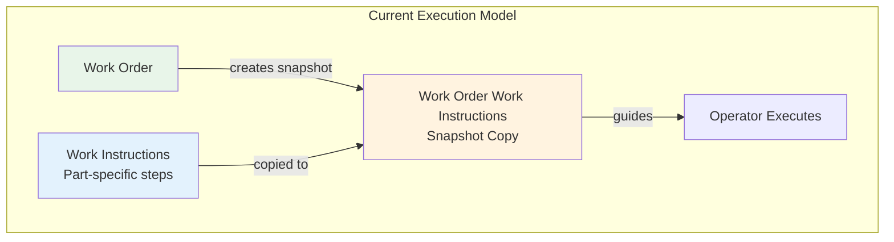
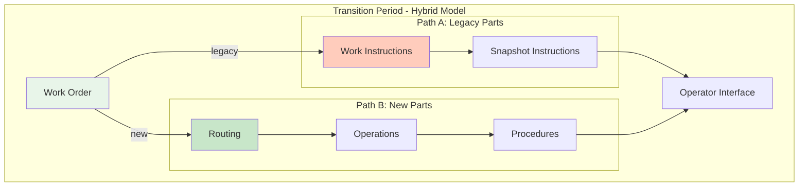
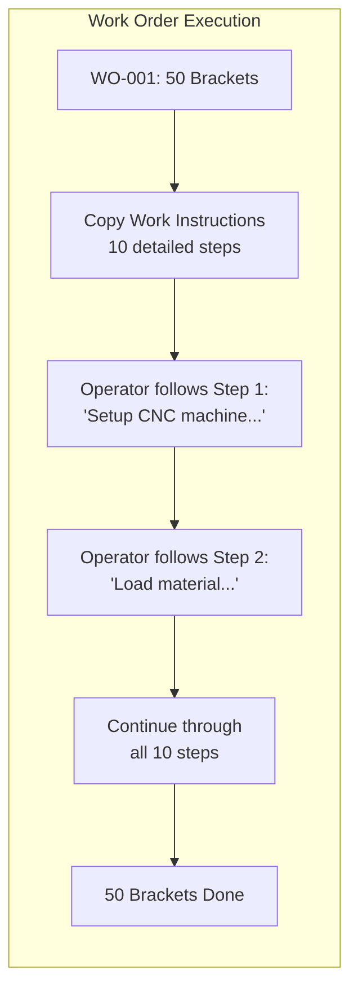
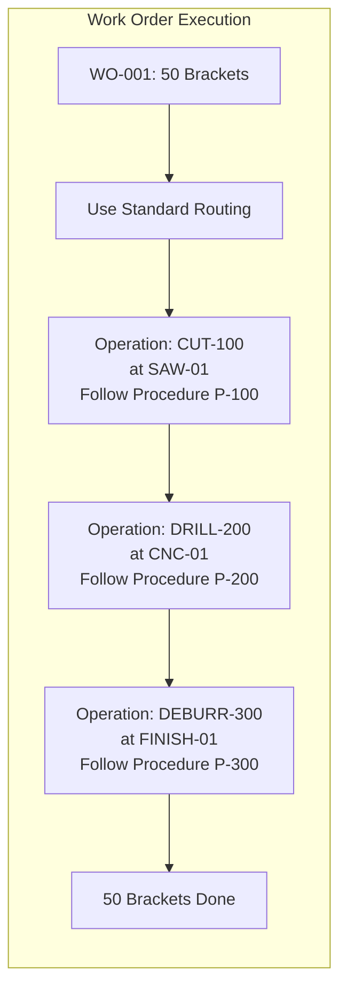
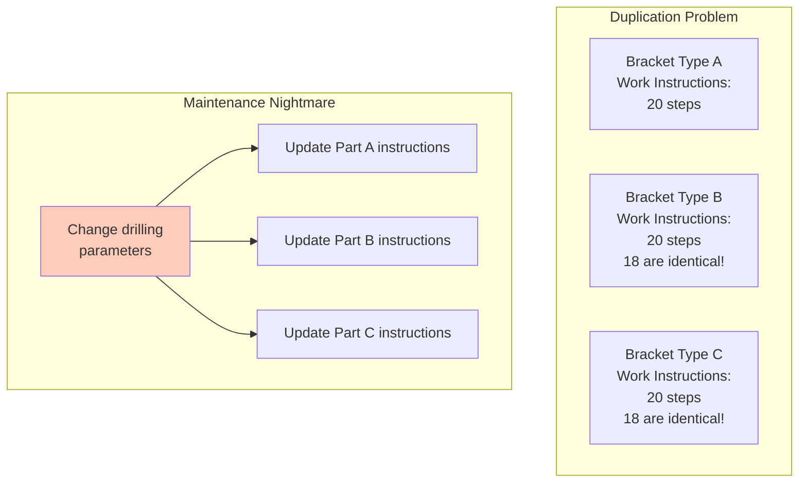
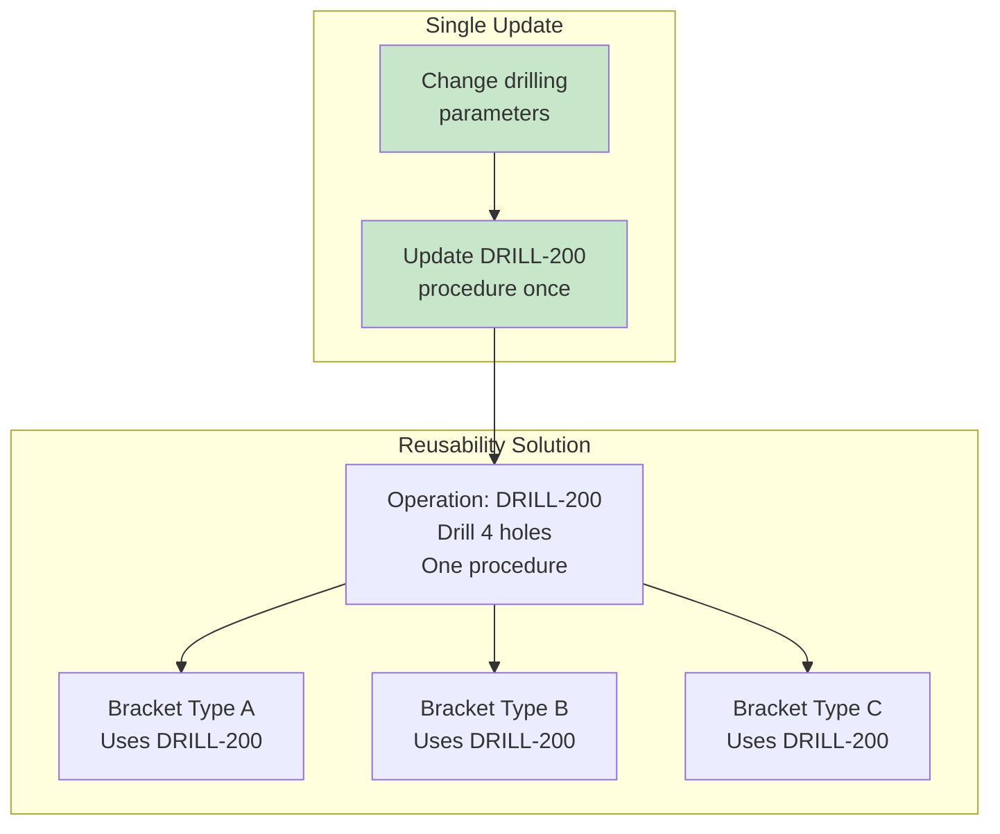
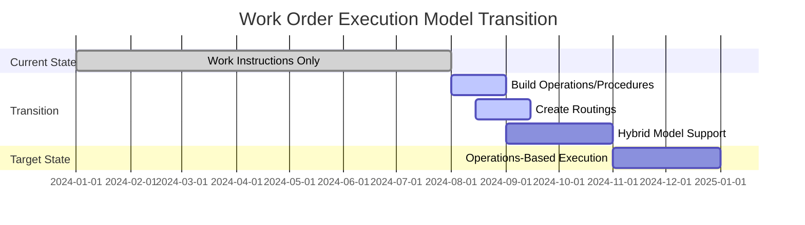

# Work Order Execution Model: Instructions vs Operations

## The Critical Question

**Is a work order executed with Work Instructions OR by Operations + Procedures?**

## The Answer: It Depends on the Evolution Phase

### Current State (Pre-MES Evolution)

Work Orders are executed with **Work Instructions**

### Target State (Post-MES Evolution)

Work Orders will be executed through **Routings → Operations → Procedures**

Let me explain both models and why this transition is happening:

---

## Model 1: Current State - Work Instruction Based (Active Now)



### How It Works Now:

1. **Work Order Created** for Part X, Quantity 100
2. **Work Instructions Copied** - System creates `WorkOrderWorkInstruction` (snapshot)
3. **Operator Follows** the copied instructions step-by-step
4. **Direct Execution** - No routing or operations involved

### Current Database Structure:

```typescript
WorkOrder {
  id: "WO-001"
  partId: "PART-123"
  workInstruction: WorkOrderWorkInstruction {
    // This is a SNAPSHOT of the instructions
    steps: [
      {
        title: "Setup machine"
        instructions: "Load fixture A..."
        actions: [checkboxes, measurements]
      },
      {
        title: "Run program"
        instructions: "Select program P123..."
        actions: [value inputs, sign-offs]
      }
    ]
  }
}
```

### Pros of Current Model:

- ✅ Simple and straightforward
- ✅ All instructions in one place
- ✅ Easy for operators to follow
- ✅ Good for low-volume, high-mix production

### Cons of Current Model:

- ❌ Instructions duplicated for every similar part
- ❌ No resource scheduling (which machine?)
- ❌ Can't optimize across work centers
- ❌ Limited reusability

---

## Model 2: Target State - Operation Based (MES Evolution Goal)

```mermaid
graph TD
    subgraph "Target Execution Model"
        WO[Work Order]
        RT[Selected Routing]
        RS[Routing Steps<br/>Sequence]
        OP[Operations<br/>Reusable]
        PROC[Procedures<br/>Detailed How-To]
        WC[Work Centers<br/>Where]
        EXEC[Operator Executes]
    end

    WO -->|selects| RT
    RT -->|contains| RS
    RS -->|references| OP
    RS -->|assigns to| WC
    OP -->|documented by| PROC
    PROC -->|guides| EXEC
    WC -->|hosts| EXEC

    style WO fill:#000
    style RT fill:#000
    style OP fill:#000
    style PROC fill:#000
    style WC fill:#000
```



### How It Will Work:

1. **Work Order Created** for Part X, Quantity 100
2. **Routing Selected** (e.g., Standard, Rush, or Alternate)
3. **Operations Scheduled** at specific Work Centers
4. **Procedures Guide** the operator through each Operation
5. **Execution Tracked** at the Operation level

### Future Database Structure:

```typescript
WorkOrder {
  id: "WO-001"
  partId: "PART-123"
  routingId: "ROUTING-STD-001"  // Selected routing

  // Execution tracked through routing steps
  currentOperation: "OP-DRILL-200"
  currentWorkCenter: "CNC-01"

  operationStatus: [
    { operationId: "OP-CUT-100", status: "COMPLETED", actualTime: 45 },
    { operationId: "OP-DRILL-200", status: "IN_PROGRESS", actualTime: 20 },
    { operationId: "OP-DEBURR-300", status: "PENDING", actualTime: 0 }
  ]
}
```

### Pros of Target Model:

- ✅ Highly reusable operations
- ✅ Resource scheduling and optimization
- ✅ Standard times and costs
- ✅ Better capacity planning
- ✅ Industry-standard approach

### Cons of Target Model:

- ❌ More complex setup
- ❌ Requires training
- ❌ Migration effort needed

---

## The Hybrid Reality During Transition



During the transition, Alamo will support BOTH models:

- **Existing parts** continue using Work Instructions
- **New parts** use the Routing/Operations model
- **Gradual migration** of existing parts to new model

---

## Detailed Execution Comparison

### Scenario: Manufacturing 50 Brackets

#### Current Model (Work Instructions):



**What the operator sees:**

```
Work Order: WO-001
Part: BRACKET-001
Instructions:
  Step 1: Setup CNC machine
    - Load fixture A into position
    - Install tool set B
    - Run warmup cycle
    [✓] Check: Fixture secured

  Step 2: Load material
    - Place aluminum sheet on bed
    - Align to stops
    [📏] Measure: Material thickness

  Step 3-10: [More detailed steps...]
```

#### Target Model (Operations + Procedures):



**What the operator sees:**

```
Work Order: WO-001
Current Operation: DRILL-200
Work Center: CNC-01
Procedure: Standard Drilling Procedure v2.1

Setup (15 min):
  1. Load drill fixture
  2. Install HSS drill bits
  3. Set spindle speed: 1500 RPM

Run (5 min/piece):
  1. Load part into fixture
  2. Execute program DRILL-4H
  3. Inspect holes
  4. Move to next station

Progress: 25/50 complete
Next: DEBURR-300 at FINISH-01
```

---

## Why the Evolution Matters

### The Problem with Work Instructions Only:



### The Solution with Operations:



---

## Implementation Timeline



---

## Key Takeaways

### 1. **Current Reality**

- Work Orders execute with **Work Instructions** (part-specific, detailed steps)
- Simple but not scalable
- Each part has its own complete set of instructions

### 2. **Future Vision**

- Work Orders will execute through **Routings → Operations → Procedures**
- Operations are reusable across many parts
- Work Centers provide resource scheduling
- Industry-standard approach

### 3. **The Transition**

- Both models will coexist during migration
- New parts use the new model
- Existing parts gradually converted
- No disruption to production

### 4. **Why It Matters**

- **Efficiency**: Write procedures once, use everywhere
- **Scheduling**: Know which work center is doing what
- **Optimization**: Balance load across resources
- **Maintenance**: Update in one place, affects all parts
- **Scalability**: Add new parts quickly by reusing operations

### 5. **For Operators**

The interface remains similar - they still see step-by-step instructions. The difference is WHERE those instructions come from:

- **Now**: From part-specific work instructions
- **Future**: From reusable operations and procedures, scheduled at specific work centers

---

## Summary Comparison Table

| Aspect                | Current (Work Instructions)    | Target (Operations + Procedures)       |
| --------------------- | ------------------------------ | -------------------------------------- |
| **Execution Path**    | WO → Work Instructions → Steps | WO → Routing → Operations → Procedures |
| **Reusability**       | Low (part-specific)            | High (operations shared)               |
| **Scheduling**        | Manual                         | Automated by work center               |
| **Maintenance**       | Update each part               | Update once per operation              |
| **Complexity**        | Simple                         | More complex but powerful              |
| **Industry Standard** | No                             | Yes                                    |
| **Best For**          | Low volume, high mix           | All production types                   |
| **Resource Planning** | Limited                        | Full capability                        |
| **Cost Tracking**     | Basic                          | Detailed by operation                  |
| **Optimization**      | Difficult                      | Built-in                               |

The evolution from Work Instructions to Operations-based execution represents a maturation from a simple document system to a true Manufacturing Execution System.
